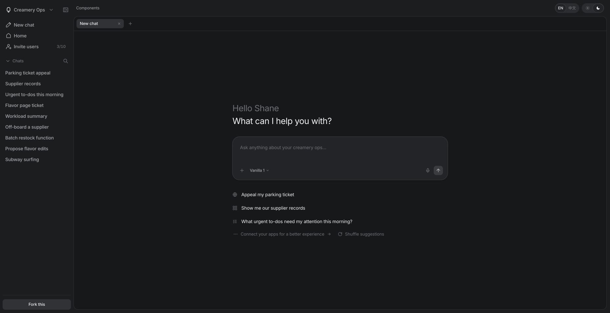
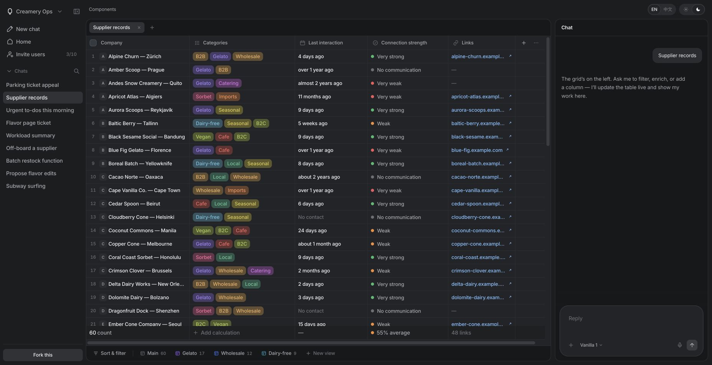

# Beautiful UI Vue

**English** | [简体中文](README.zh-CN.md)

[Beautiful UI Vue](https://github.com/jiajie-yang/beautiful-ui-vue) is an independent project ported and rewritten from [Beautiful UI](https://github.com/slev12397/beautiful-ui) using Vue 3 + Vite + TypeScript + Tailwind CSS 4, preserving the original components, interactions, and visual design. Components use native Vue JSX, and the application shell uses Vue SFCs, without a React compatibility layer. The project has its own Git repository, dependencies, lockfile, and build configuration, and can be moved and deployed independently.

This README is available in Chinese and English. The demo UI supports English and Simplified Chinese, with language switches on the gallery and Harness pages.

## Preview

Desktop chat and supplier workspace in English:




## Running and validation

Requires Node.js 22.12+ and a system-installed pnpm. The current lockfile and CI use pnpm 10.33.0.

Run these commands from the root of this repository.

Install dependencies:

```sh
pnpm install --frozen-lockfile
```

Start the development server:

```sh
pnpm dev
```

Stop it with Ctrl+C, or use another terminal, before building and running tests:

```sh
pnpm build
pnpm test
```

After building, start the production preview and keep this terminal running:

```sh
pnpm preview
```

The production HTTP tests read `dist`, so run the build before running tests for the first time. GitHub Actions runs a locked dependency installation, type checking, registry generation, a production build, and the full test suite on pushes to `main` and pull requests. It also checks that generated registry files match the committed versions. Routes: `/` for the component gallery, `/harness` for the Ice Cream Harness, and `/license` for the MIT license. Development and preview servers listen on localhost by default.

## Migration scope

- 11 atoms and 22 product components (primitives), including 21 gallery entries and all 16 variant options.
- All 10 Harness demo scenarios, chat tabs, the supplier workspace, property configuration, sidebar, browser viewer, and recording states.
- Persistent theme preferences, source viewing and copying, installation instructions, email forms and prompts, interaction sounds, streaming animations, and Canvas-rendered charts.
- Local fonts and images, design tokens, keyframes, reduced-motion styles, and MIT and third-party licenses.
- A Vue component registry that collects transitive dependencies from actual imports, including shared atoms, utilities, chart drawing code, and license files.
- An independent Node subscription API with the same logic used by Vite development, preview, and the production server.

Like the original, the Harness uses mock data and scripted demonstrations. It does not perform real supplier operations, submit parking appeals, or connect to a model. The Surfer variant retains the original remote video URL and depends on that video service remaining available.

## Installing components

Prepare a Vue 3 project with Tailwind 4, an `@` alias pointing to `src`, and `@vitejs/plugin-vue-jsx` enabled. Set TypeScript's `jsx` to `preserve` and `jsxImportSource` to `vue`.

In the consuming project, initialize shadcn-vue if it does not already have a configured `components.json`. Follow the prompts to configure its CSS path and aliases:

```sh
pnpm dlx shadcn-vue@latest init
```

In this repository, start the local registry preview and keep it running:

```sh
pnpm build
pnpm preview
```

Then install a component from a separate terminal in your consuming project:

```sh
pnpm dlx shadcn-vue@latest add http://127.0.0.1:4173/r/agent-screen.json
```

The registry lives in `public/r/` and contains 33 items: 21 gallery components, 11 atoms, and GlideMenu. Each item includes its complete local dependencies and foundation CSS. AgentScreen's demo image is embedded in the installation source to avoid missing images after installation. Registry license files preserve the full license text inside block comments for compatibility with the installer's source parser; the repository license files retain their original text. Use `pnpm build:registry` to regenerate registry files without building the application.

The registry does not install the font packages. Install them in the consuming project:

```sh
pnpm add @fontsource-variable/inter @fontsource-variable/jetbrains-mono
```

Add these imports to your existing application entry point (for example, `src/main.ts`):

```ts
import '@fontsource-variable/inter'
import '@fontsource-variable/jetbrains-mono'
import './styles/globals.css'
import './styles/site.css'
```

The installer does not enable the Vite JSX plugin or modify your application entry point. See the [official shadcn-vue registry format documentation](https://www.shadcn-vue.com/docs/registry/registry-item-json).

## Deployment and subscriptions

```sh
cp .env.example .env
# Set RESEND_API_KEY in .env
pnpm build
pnpm start
```

The default address is `127.0.0.1:3000`. Set `HOST` to listen on another interface and `PORT` to change the port. The production server serves `dist`, provides a history routing fallback, and handles `POST /api/subscribe`. Static hosting requires a separate proxy for this API and a fallback to `index.html` for page routes. Missing static resources return 404.

`RESEND_API_KEY` is read only on the server and must not use a `VITE_` prefix. Use a Resend key that can manage contacts. A missing key returns 503. For duplicate subscriptions, the API first confirms that the contact exists and does not overwrite its unsubscribe state. Validation uses mocked Resend responses; no test contacts have been created in the real Resend service.

## Validation and differences

See the [migration validation report](docs/MIGRATION_VALIDATION.md). Commercial Central Icons have been replaced with local SVGs that preserve dimensions and semantics, with some differences in glyph shapes. React Agentation has been replaced with a Vue development tool for selecting elements, entering feedback, and copying it, without Agentation's external service integration. Inter and JetBrains Mono are loaded locally through Fontsource; font versions may introduce minor rasterization differences compared with Google's hosted builds.

This project maintains its own version history. It is not a submodule of the original project and has no runtime imports or symbolic links pointing to it. The original author's MIT copyright notice and third-party licenses are preserved. See [UPSTREAM.md](UPSTREAM.md) for sources and versions.

## Interface language

The gallery and `/harness` have an EN / 中文 switch. Locale follows the browser on first visit and persists locally afterward. Vue I18n 11 manages the shared Composition API instance, English fallback and interpolation. Registry items include `src/lib/i18n.ts`, `src/lib/locales` and the `vue-i18n` dependency; import `setLocale` from `@/lib/i18n` to select `en` or `zh-CN`. Component IDs and variant values remain stable; supplied labels, business data, user input, code and licenses are displayed literally. See [localization maintenance](docs/I18N.zh-CN.md) for stable keys, adding languages and the boundary between UI messages and supplied data.

See [Chinese interface validation](docs/LOCALIZATION_VALIDATION.zh-CN.md) for coverage and limits.
