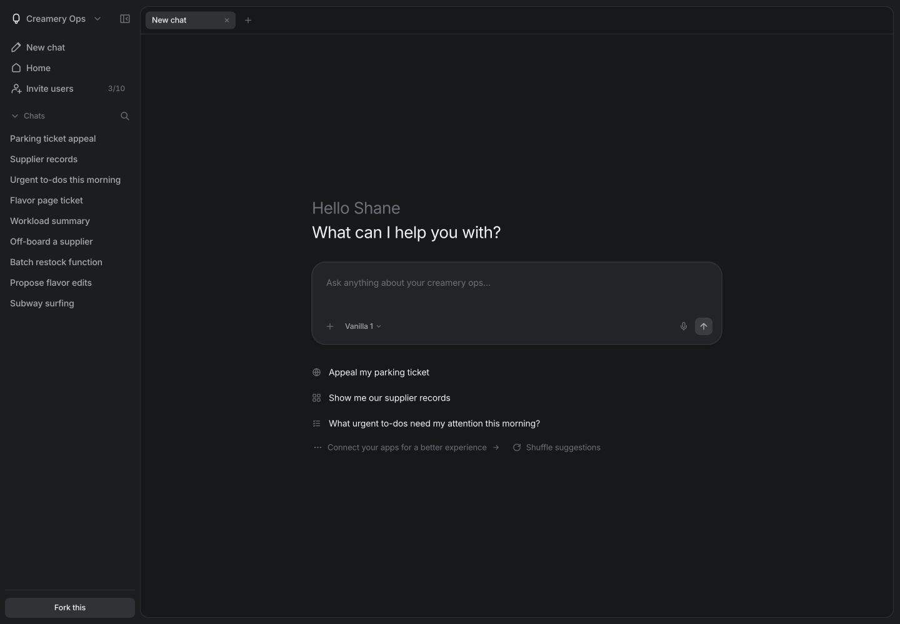
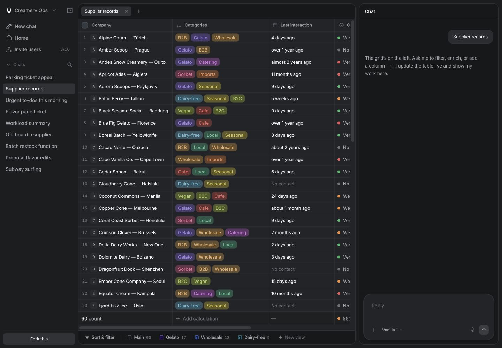

# Beautiful UI Vue

[English](README.md) | **简体中文**

[Beautiful UI Vue](https://github.com/jiajie-yang/beautiful-ui-vue) 是基于 [Beautiful UI](https://github.com/slev12397/beautiful-ui) 迁移并改写的独立项目，采用 Vue 3 + Vite + TypeScript + Tailwind CSS 4 技术栈，保留原版的组件、交互与视觉设计。组件使用原生 Vue JSX，站点外壳采用 Vue SFC；不使用 React 兼容层。拥有自己的 Git 仓库、依赖、锁文件与构建配置，可独立移动和部署。

本 README 与界面均支持英文和简体中文。首页和 `/harness` 顶部提供 EN / 中文切换；首次访问根据浏览器语言选择，之后记住用户选择。切换时保留当前聊天、输入草稿和组件交互状态。品牌名、代码、文件路径、用户输入与许可证原文保持原样。

## 预览

桌面聊天与供应商工作区：




## 运行与验证

Node.js 22.12+，使用系统安装的 pnpm；当前锁文件及 CI 使用 pnpm 10.33.0。

以下命令均在本仓库根目录执行。

安装依赖：

```sh
pnpm install --frozen-lockfile
```

启动开发服务：

```sh
pnpm dev
```

按 Ctrl+C 停止开发服务，或另开终端，再执行构建与测试：

```sh
pnpm build
pnpm test
```

构建后启动生产预览，并保持该终端运行：

```sh
pnpm preview
```

测试中的生产 HTTP 验证读取 dist，首次测试前先执行 build。GitHub Actions 对 main 推送和 pull request 执行锁文件安装、类型检查、注册表生成、生产构建及全量测试，并检查注册表生成结果与提交一致。页面：`/` 组件画廊、`/harness` Ice Cream Harness、`/license` MIT 许可证；开发与预览均默认只监听本机。

## 迁移内容

- 11 个基础控件（atoms）、22 个产品组件（primitives），含 21 个画廊项目及全部 16 个变体选项。
- 完整 Harness 的 10 个演示场景、聊天标签、供应商工作区、属性配置、侧栏、浏览器查看器和录制状态。
- 主题持久化、源码查看与复制、安装说明、邮箱表单与提示、交互音效、流式动画和 Canvas 绘制的图表。
- 本地字体与图片、完整设计 token / keyframes / reduced-motion 样式、MIT 及第三方许可。
- Vue 组件注册表，自动收集真实导入的传递依赖；包含共享基础控件、工具、图表绘制代码及许可文件。
- 独立 Node 订阅 API；Vite dev / preview 和生产服务使用同一逻辑。

Harness 与原版相同，使用假数据和脚本演示，不会真的操作供应商、提交停车申诉或连接模型。Surfer 变体保留原版远端视频链接，其可用性依赖原视频服务。

## 组件安装

先准备 Vue 3、Tailwind 4、`@` 指向 `src` 的别名，并启用 `@vitejs/plugin-vue-jsx`、TypeScript `jsx: preserve` / `jsxImportSource: vue`。

在使用组件的项目中，如果还没有配置好的 `components.json`，先初始化 shadcn-vue，按提示配置 CSS 路径和别名：

```sh
pnpm dlx shadcn-vue@latest init
```

在本仓库中启动本地注册表预览，并保持服务运行：

```sh
pnpm build
pnpm preview
```

再在使用组件的项目中，另开终端安装：

```sh
pnpm dlx shadcn-vue@latest add http://127.0.0.1:4173/r/agent-screen.json
```

注册表在 `public/r/`，共 33 项（21 个画廊组件、11 个基础控件、GlideMenu）。每项包含完整本地依赖及基础 CSS；AgentScreen 的演示图片嵌入安装源码，避免安装后图片缺失。许可证在注册表中用块注释包裹全文，兼容安装器的源码解析，原仓库许可证保留原文。仅重新生成注册表而不构建应用时，可运行 `pnpm build:registry`。

国际化采用 Vue I18n 11 的 Composition API，使用稳定文案键、独立中英文资源和英文回退。注册表包含共享的 `src/lib/i18n.ts`、`src/lib/locales`，并声明 `vue-i18n` 依赖。使用组件的应用可以从 `@/lib/i18n` 导入 `setLocale`，调用 `setLocale('zh-CN')` 或 `setLocale('en')` 统一切换显示文案；组件 ID 和变体值保持稳定，外部标签、业务数据及代码原样显示；默认示例的展示文案通过稳定键翻译。新增文案和语言的流程见[国际化维护说明](docs/I18N.zh-CN.md)。

注册表不会安装字体包，需要在使用组件的项目中执行：

```sh
pnpm add @fontsource-variable/inter @fontsource-variable/jetbrains-mono
```

在现有应用入口（例如 `src/main.ts`）中添加以下导入：

```ts
import '@fontsource-variable/inter'
import '@fontsource-variable/jetbrains-mono'
import './styles/globals.css'
import './styles/site.css'
```

安装器不会替你启用 Vite JSX 插件或修改应用入口。注册表格式参考 [shadcn-vue 官方文档](https://www.shadcn-vue.com/docs/registry/registry-item-json)。

## 部署与订阅

```sh
cp .env.example .env
# 在 .env 中配置 RESEND_API_KEY
pnpm build
pnpm start
```

默认 `127.0.0.1:3000`；需要对外监听时配置 HOST，端口用 PORT。生产服务同时提供 dist、history 路由回退和 `POST /api/subscribe`。纯静态托管需要另行代理这个 API，并将页面路径回退到 index.html；缺少的静态资源返回 404。

RESEND_API_KEY 仅在服务端读取，不能使用 `VITE_` 前缀。需要能管理 contacts 的 Resend key。缺少 key 时返回 503，重复订阅先确认已有 contact，不覆盖退订状态。验证使用模拟 Resend 响应，未向真实 Resend 创建测试联系人。

## 已验证与差异

详见 [迁移验证报告](docs/MIGRATION_VALIDATION.zh-CN.md)。商业 Central Icons 改为本地 SVG，保持尺寸和语义，少数字形与原版不同；React Agentation 改为 Vue 开发工具，提供选元素、填写反馈和复制功能，不包含 Agentation 的外部服务集成。Inter / JetBrains Mono 改为本地 Fontsource 加载，字体文件版本与 Google 在线构建可能存在细微光栅差异。

本项目拥有独立版本历史，不是原项目的 submodule，也没有指向原版的运行时导入或符号链接。保留原作者 MIT 版权声明及第三方许可。来源和版本见 [UPSTREAM.zh-CN.md](UPSTREAM.zh-CN.md)。

简体中文功能的测试范围与验证记录见 [中文界面验证说明](docs/LOCALIZATION_VALIDATION.zh-CN.md)。
